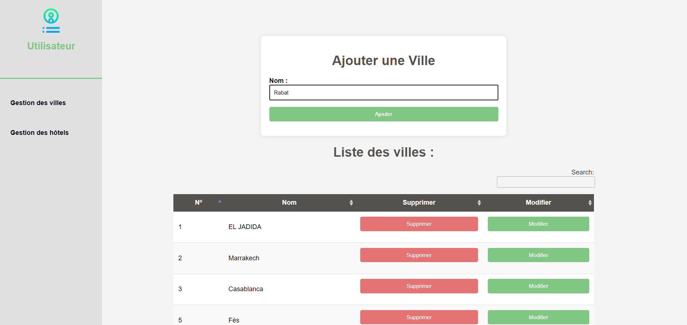

# EJB

### Gestion des villes

#### Ajout d'une ville

##### Voilà la ville est bien ajoutée

#### Suppression d'une ville

#### Modfication d'une ville

#### Rechercher par nom du ville

### Gestion des hôtels

#### Ajout d'un hôtel

##### Voilà l'hôtel est bien ajouté

#### Suppression d'un hôtel

#### Modfication d'un hôtel

#### Rechercher des hôtels par ville

